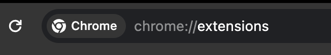
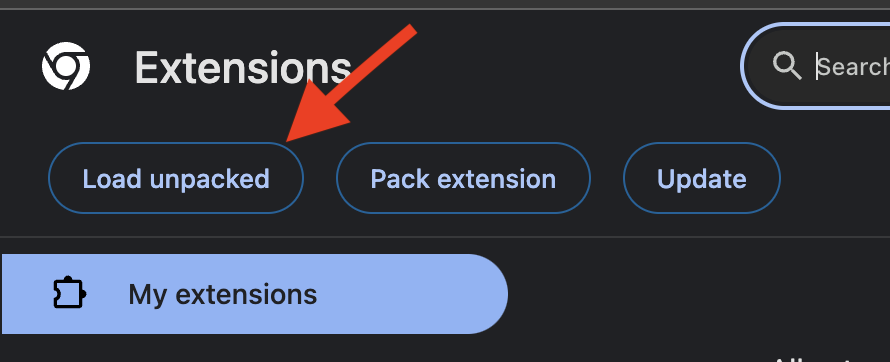
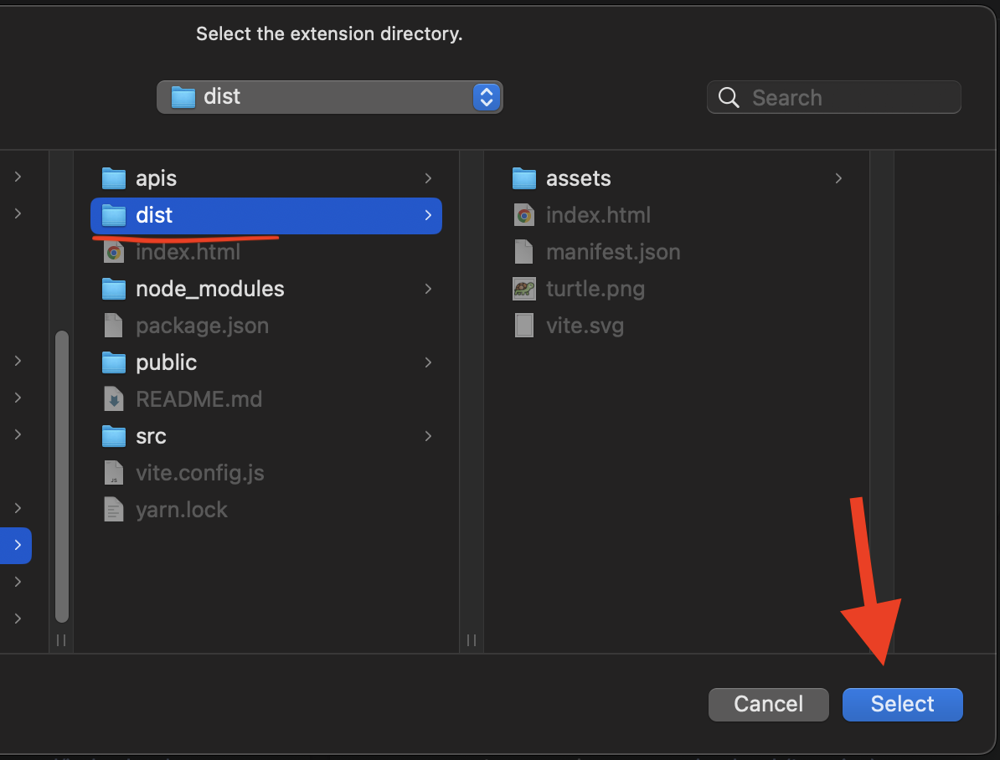
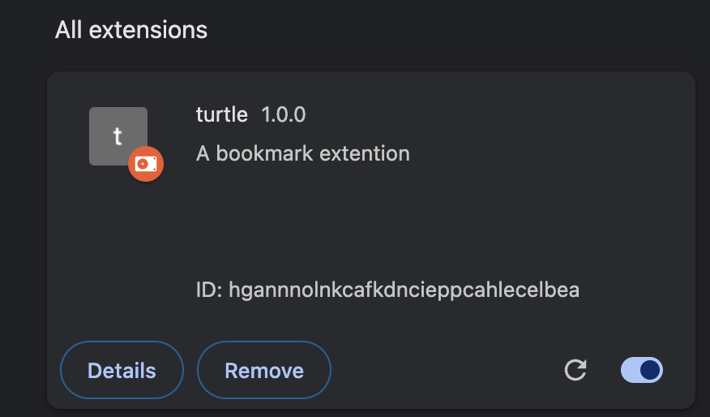

# turtle 

turtle is a Google Chrome extension that enhances bookmarking by allowing users to tag their bookmarks for easy organization and retrieval. The extension provides a simple and intuitive interface for adding tags to bookmarks, making it easier to categorize and find them later.

### How to setup

Clone the project
```bash git clone https://github.com/H4K3R13/turtle.git 


```bash
yarn 
yarn run build
```

- Step 1: Navigate to Chromes extensions settings
  
- Step 2: Click on `Load unpacked`
  
- Step 3: Select the build folder
  
- Step 4: The extensions will load up here
  
